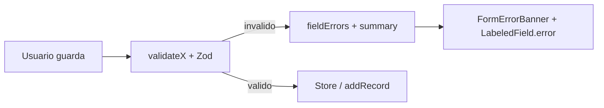

# Validación de formularios y feedback de errores en DataHub

**Fecha:** 2026-05-20  
**Ámbito:** DataHub (Club, Maduración, Rendimiento)  
**Tipo:** Mejora de UX + capa técnica compartida

## Contexto

Al guardar jugadores, mediciones, tests, equipos o resultados de rendimiento, si faltaban campos obligatorios (fecha, equipo, nombre, etc.) la acción **no se completaba** pero la interfaz **no explicaba el motivo**. En algunos casos:

- `return` silencioso en handlers de guardado (Club).
- Validación Zod parcial en Maduración con mensajes en inglés y un solo error (`error:...`).
- Rendimiento mostraba éxito aunque `addPerformanceEntry` no persistía nada si no encontraba al jugador.

Tras la primera implementación apareció un bug de React: claves duplicadas en el banner cuando varios campos compartían el mensaje genérico *"This field is required."*

## Objetivo

1. Mostrar **qué falta** antes o al intentar guardar: banner resumen + mensaje bajo cada campo.
2. Mensajes en **español/inglés** según locale (`datahub.validations.*`).
3. Validación coherente en **importación Excel** (conteo de filas omitidas, no errores campo a campo por fila).
4. Corregir textos sin traducir y reglas de negocio acordadas (equipo obligatorio al dar de alta jugador en Club).

## Arquitectura de la solución



### Capa compartida

| Archivo | Responsabilidad |
|---------|-----------------|
| [`src/lib/validations.ts`](../../../src/lib/validations.ts) | Esquemas Zod: antropometría, jugador club, equipo, test, entrada rendimiento, perfil jugador (edición). |
| [`src/lib/form-errors.ts`](../../../src/lib/form-errors.ts) | `zodToFieldErrors`, `resolveValidationMessage`, validadores por pantalla, etiquetas de campo para el banner. |
| [`src/components/form-error-banner.tsx`](../../../src/components/form-error-banner.tsx) | Banner: resumen + lista `Campo: mensaje` con `key` único por campo. |
| [`src/components/field-error.tsx`](../../../src/components/field-error.tsx) | Texto bajo input + clase `invalidInputClass`. |
| [`src/components/labeled-field.tsx`](../../../src/components/labeled-field.tsx) | Prop opcional `error`. |

### i18n

Claves bajo `datahub.validations` en [`src/lib/i18n/dictionaries.ts`](../../../src/lib/i18n/dictionaries.ts):

- `summary` — texto del banner superior.
- `required.*` — mensaje por campo (nombre, equipo, fecha, estatura, etc.).
- `issue.*` — reglas de negocio (fecha futura, rango estatura, jugador no encontrado, etc.).
- Import Excel: `bulkAddPartial`, `bulkAddValidationError`, `importMeasurementsPartial`, `importMeasurementsNone`.

### Corrección de mensajes genéricos duplicados

En `resolveValidationMessage`, el código Zod `"required"` **no** debe mapearse primero a `datahub.validations.issue.required`. Orden correcto:

1. Si el issue es `required` / `too_small` → mensaje de `FIELD_REQUIRED_KEYS[field]`.
2. Si no hay clave de campo → mensaje genérico.
3. Resto de códigos (`future_date`, `stature_range`, …) vía `ISSUE_MESSAGE_KEYS`.

## Cambios por pantalla

### Club — Jugadores (`PlayersTab`)

- Validación con `ClubAthleteSchema`: nombre, grupo de edad, fecha nacimiento, **teamId obligatorio**.
- Estado local `formErrors` + `formSummary`.
- `FormErrorBanner` y `FieldError` en modales añadir/editar.
- Errores se limpian al editar el campo (`clearFieldError`).

### Club — Equipos (`TeamsTab`)

- `ClubTeamSchema`: nombre y grupo de edad.
- Misma UX de banner + errores por campo.

### Club — Batería de tests (`addDef`)

- `TestDefinitionSchema`: nombre y unidad.
- Errores en formulario inline de alta de métrica.

### Club — Importación Excel de jugadores

- Cada fila pasa por `validateClubAthlete` (incluye equipo existente en la lista de equipos del club).
- Filas inválidas se omiten y se cuenta `skipped`.
- Feedback:
  - Éxito total: `bulkAddSuccess`.
  - Parcial: `bulkAddPartial` (`{imported}`, `{skipped}`).
  - Ninguna válida: `bulkAddValidationError`.

### Maduración — Añadir medición

- [`page.tsx`](../../../src/app/(protected)/datahub/page.tsx): `validateAnthropometric` con `requireAthlete: true`.
- Estado `fieldErrors` + `formSummary` pasados a `MaturationSection`.
- `AthleteSelector`, `AddMeasurementFormBody`, `ModalShell` muestran errores.
- Valores numéricos en `0` se tratan como vacíos antes de Zod (mensaje de campo requerido, no “mínimo 120 cm”).

### Maduración — Editar jugador (modal)

- `validateMaturationPlayerProfile` (sin exigir medidas antropométricas en el mismo modal).
- Banner de errores en el modal (antes no mostraba feedback).

### Maduración — Edición inline de medición (panel jugador)

- Validación al guardar con `validateAnthropometric` y errores locales.

### Maduración — Importación Excel

- [`parseMeasurementImportWithStats`](../../../src/lib/datahub/excel.ts) devuelve `{ records, skipped }`.
- Feedback: `imported:N`, `import-partial:N:S`, `import-none:S` traducidos en `ModalShell`.

### Rendimiento — Añadir resultado

- `validatePerformanceEntry` (jugador, fecha, test, valor o rating según definición).
- `addPerformanceEntry` devuelve `boolean` ([`app-state.tsx`](../../../src/lib/store/app-state.tsx) + [`app-state-updaters.ts`](../../../src/lib/store/app-state-updaters.ts)).
- Solo muestra éxito si `added === true`; si no hay jugador reconocido → `athleteNotFound`.

### Rendimiento — Carga de entrenamiento

- Texto auxiliar cuando el botón guardar está deshabilitado: `datahub.validations.issue.trainingLoadPrereq` (falta equipo o fecha).

### Otros

- Etiqueta **"Team Photo (optional)"** sustituida por `t("datahub.photoOptional")` en modales de equipo.

## Archivos modificados (lista principal)

```
src/lib/validations.ts
src/lib/form-errors.ts
src/lib/i18n/dictionaries.ts
src/lib/datahub/excel.ts
src/lib/store/app-state.tsx
src/lib/store/app-state-updaters.ts
src/components/form-error-banner.tsx
src/components/field-error.tsx
src/components/labeled-field.tsx
src/app/(protected)/datahub/page.tsx
src/app/(protected)/datahub/club-section.tsx
src/app/(protected)/datahub/maturation-section.tsx
src/app/(protected)/datahub/performance-section.tsx
```

## Comportamiento esperado (verificación manual)

1. Club → Añadir jugador sin nombre / fecha / equipo → banner + lista etiquetada + borde rojo bajo campos; modal no se cierra.
2. Maduración → Medición sin jugador o con estatura vacía → mensajes en idioma activo, no texto crudo `error:...`.
3. Rendimiento → Resultado sin jugador válido → error visible, **sin** mensaje de éxito falso.
4. Excel jugadores → filas incompletas omitidas con mensaje de conteo.
5. Excel mediciones → mensaje si todas o parte de filas se omiten.
6. Consola sin warning `Encountered two children with the same key` en `FormErrorBanner`.

## Riesgos y seguimiento

| Tema | Nota |
|------|------|
| `saveEditPlayer` en Maduración | Sigue llamando a `addRecord` con perfil sin medición completa; la validación del modal es solo de perfil. Revisar si el flujo de negocio debe ser `updateAthlete` en lugar de `addRecord`. |
| Excel | No hay detalle fila a fila de qué columna falló; solo contadores agregados. |
| `AddPlayerFormBody` en maturation-section | Componente sin referencias; no actualizado en este cambio. |
| Tests automatizados | No se añadieron tests unitarios de `form-errors` / Zod en este PR. |

## Referencias

- Plan de trabajo: validación unificada DataHub (mayo 2026).
- ADR estructura docs: [`../decisions/ADR-001-documentation-structure.md`](../decisions/ADR-001-documentation-structure.md).
